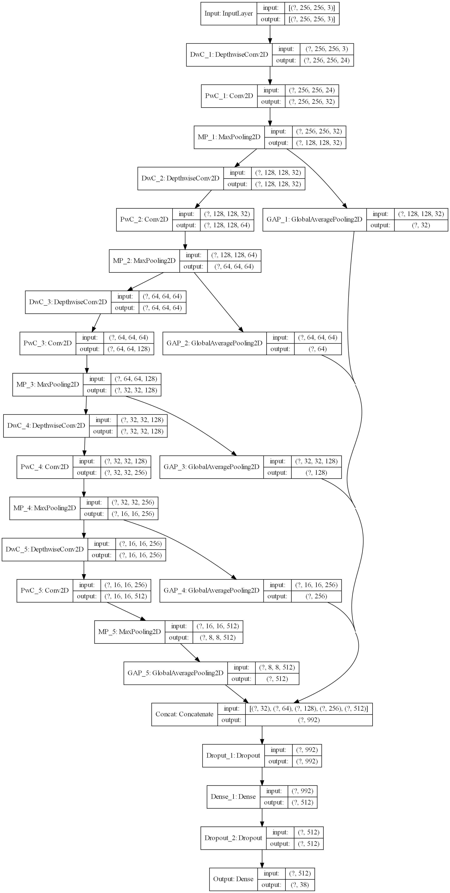
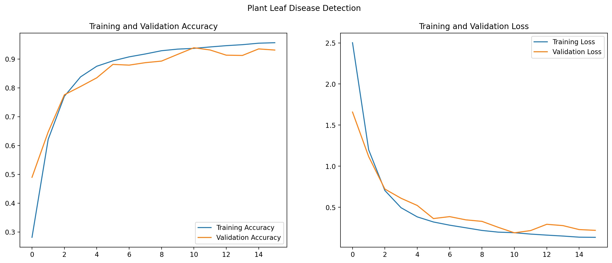
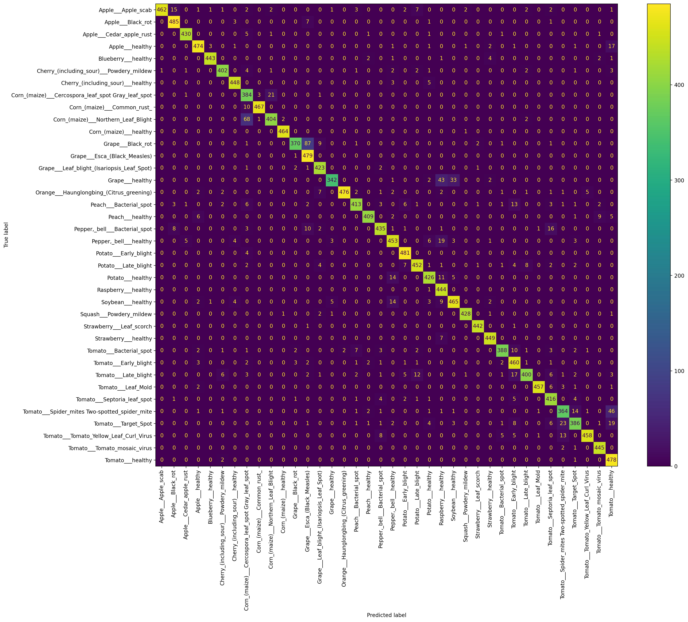

# Plant Leaf Disease Detection
**Deep learning using TensorFlow on image datasets containing healthy and diseased crop leaves.**

This project can run as a mobile-friendly web app where farmers upload a leaf photo and receive:
- the predicted crop and disease,
- model confidence and top alternative matches,
- practical crop-specific treatment recommendations.

## Dataset
The dataset for this project can be downloaded from:
- [New Plant Diseases Dataset (Kaggle)](https://www.kaggle.com/vipoooool/new-plant-diseases-dataset)

This dataset consists of 87,900 images of leaves spanning 38 classes. Each class denotes a combination of the plant the leaf is from and the disease (or lack thereof) present in the leaf. All images are 256*256 in resolution.

The dataset is divided into three parts as follows:

- **train** - 70,295 images divided into 38 classes with 1,642 to 2,022 images per class.
- **valid** - 17,572 images divided into 38 classes with 410 to 505 images per class.
- **test** - 33 images (These images are not divided into their respective classes but the class can be inferred from the image filename)

## Project Requirements
Install the app and training dependencies:

```bash
pip install -r requirements.txt
```

The notebook also uses pandas and scikit-learn for analysis and reports.

## Web App
Run the upload and prediction app:

```bash
python app.py
```

Open `http://localhost:5000`, upload a clear leaf image, and submit it for detection. The app uses the saved TensorFlow model in `models/plant_leaf_disease_detector`.

## Model
The included saved model is a deep Convolutional Neural Network with skip connections created using the TensorFlow Keras Functional API.

The different layers used in this model are as follows:
- Input
- Depthwise Convolution 2D
- Convolution 2D
- Max Pooling 2D
- Global Average Pooling 2D
- Concatenation
- Dropout
- Dense

The model makes sure of **Early Stopping** and **Tensorboard** callbacks to prevent overfitting and monitor training respectively.

## MobileNetV2 Transfer Learning
To fine-tune a mobile-friendly MobileNetV2 model on the PlantVillage directory structure:

```bash
python train_mobilenetv2.py --data-dir /path/to/New Plant Diseases Dataset(Augmented)/New Plant Diseases Dataset(Augmented)
```

Expected dataset layout:

```text
dataset-root/
  train/
    Apple___Apple_scab/
    ...
  valid/
    Apple___Apple_scab/
    ...
```

The script freezes ImageNet MobileNetV2 first, trains a classifier head, then unfreezes the last layers for fine-tuning. It writes the model to `models/plant_leaf_mobilenetv2` and class labels to `models/plant_leaf_mobilenetv2.classes.txt`.

### Structure


### Accuracy and Loss


### Confusion Matrix for Validation data


### Metrics

|                               | Train  | Validation | Test   |
|-------------------------------|--------|------------|--------|
| **Count of Records**          | 70,295 | 17,572     | 33     |
| **Categorical Cross-entropy** | 0.1908 | 0.186      |   -    |
| **Categorical Accuracy**      | 93.70% | 93.91%     | 93.93% |

&nbsp;

### TensorBoard

Use the command _**tensorboard --logdir tensorboard_logs/fit**_ using the command line from the project's root directory to open the TensorBoard GUI in your browser.

### Notes
- Make sure to update the _**BASE_PATH**_ constant in _**Train.ipynb**_ to reflect the location where your dataset is stored.
